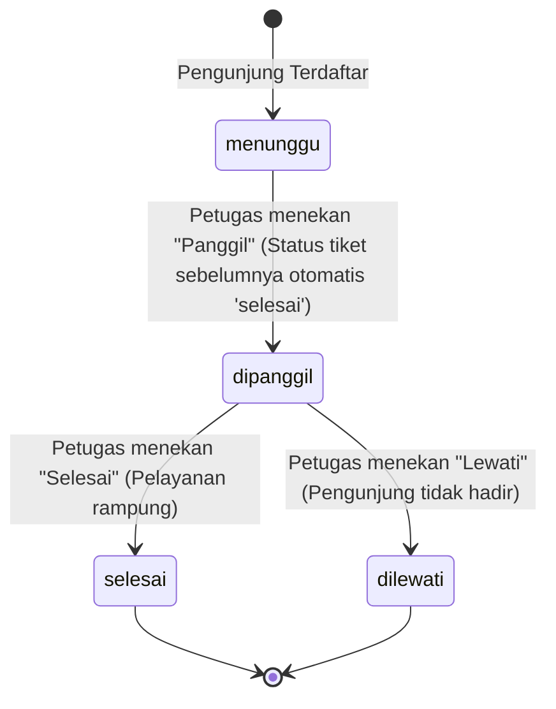

# 📝 Spesifikasi Teknis & Alur Kerja - Sistem Antrian BPS Tegal

Dokumen ini ditujukan untuk pengembang dan administrator sistem guna menjelaskan arsitektur logika, alur data, mekanisme real-time, dan sistem notifikasi suara pada aplikasi **Sistem Antrian Cerdas BPS Tegal**.

---

## 1. Mekanisme Real-Time & Pembaruan Status Pengunjung

Aplikasi ini menggunakan pendekatan **AJAX Polling** yang ringan namun efisien untuk memperbarui status antrian di layar smartphone pengunjung tanpa memerlukan koneksi WebSocket persisten (seperti Pusher/Socket.io), sehingga meminimalkan beban server dan biaya infrastruktur.

### A. AJAX Polling (Interval 5 Detik)
Pada halaman `resources/views/pengunjung/tiket.blade.php`, script JavaScript akan mengeksekusi request `GET` secara berkala setiap 5000 ms (5 detik) ke endpoint:
`Route::get('/api/antrian/status/{id}', [AntrianController::class, 'apiStatus'])`

### B. Payload API Status Tiket
Contoh respons JSON dari server:
```json
{
  "kode_antrian": "K-005",
  "status": "menunggu",
  "sedang_dipanggil": "K-002",
  "sisa_antrian": 2,
  "estimasi_menit": 20,
  "total_antrian": 12,
  "keperluan": "Konsultasi",
  "total_antrian_keperluan": 7,
  "sudah_dilayani": 3
}
```

### C. Logika Perhitungan di Layar Tiket
1.  **Estimasi Waktu Tunggu**:
    $$\text{Estimasi Waktu} = \text{Sisa Antrian Di Depan} \times 10 \text{ menit}$$
2.  **Progress Bar Visual**:
    $$\text{Persentase Kemajuan} = \left( \frac{\text{Antrian Sudah Dilayani}}{\text{Total Antrian Keperluan Hari Ini}} \right) \times 100\%$$
    Progress bar ini memberikan gambaran visual yang transparan mengenai kelancaran pelayanan loket pada hari tersebut.

---

## 2. Sistem Notifikasi Panggilan Suara (Audio & Speech Synthesis)

Salah satu fitur paling inovatif dari aplikasi ini adalah kemampuan browser smartphone pengunjung untuk berbunyi dan berbicara memanggil nomor antrian mereka secara mandiri.

### A. Komponen Teknis Notifikasi
1.  **Lonceng Dering (Chime Alert)**:
    Menggunakan browser audio player. Ketika status antrian berubah dari `menunggu` menjadi `dipanggil` saat AJAX polling berlangsung, sistem akan memutar file audio lonceng/chime standar berulang kali (selama 15 detik) untuk menarik perhatian pengunjung.
2.  **Text-to-Speech (TTS) Engine**:
    Memanfaatkan browser-native **Web Speech API (SpeechSynthesis)**. Sistem akan merangkai string panggilan dan mengeksekusinya menggunakan suara bahasa Indonesia (`id-ID`).
    *   *Pola Pemanggilan*: `"Nomor antrian [Kode Antrian], silakan menuju loket pelayanan."`
    *   *Optimalisasi Pengucapan*: Untuk memastikan kejelasan, kode antrian seperti `K-001` diparse menjadi pengucapan kata per huruf/angka (misal: "K-nol-nol-satu") menggunakan JavaScript regex sebelum disintesis oleh browser.

### B. Penanganan Autoplay Policy Browser (Crucial Developer Note)
> [!WARNING]
> Kebanyakan browser modern (Chrome Mobile, Safari iOS) menerapkan **Autoplay Policy** yang ketat: Audio tidak diizinkan berbunyi secara otomatis sebelum adanya interaksi fisik pertama dari pengguna di halaman tersebut (seperti klik/sentuhan).

**Solusi Arsitektural dalam Aplikasi**:
Saat pengunjung pertama kali membuka tiket digital, halaman akan menampilkan tombol interaktif yang mengharuskan mereka menyentuh/mengklik layar (misalnya tombol **"Aktifkan Suara Panggilan"** atau persetujuan notifikasi). Klik pertama ini dimanfaatkan oleh JavaScript untuk:
1.  Memicu pemutaran audio sunyi singkat (0.1 detik) guna membuka blokir audio konteks (unmuting audio context).
2.  Menginisialisasi engine `speechSynthesis`.
3.  Menandai browser bahwa izin audio telah diberikan (user-interacted), sehingga saat status berubah menjadi `dipanggil`, notifikasi suara dapat berbunyi dengan lancar di latar belakang tanpa terblokir.

---

## 3. Logika State & Aksi Petugas (Admin Control Flow)

Pengelolaan antrian sepenuhnya dikendalikan oleh petugas loket melalui dashboard utama. Perubahan status antrian diatur dengan aturan transisi state yang ketat guna menjaga integritas data statistik.



### A. Metode Panggilan (`panggil`)
Ketika petugas menekan tombol panggil untuk keperluan tertentu (misal: Konsultasi):
1.  **Auto-Finish**: Sistem mencari antrian pada keperluan tersebut yang saat ini sedang berstatus `dipanggil` (jika ada), mengubah statusnya menjadi `selesai`, dan mencatat `waktu_selesai = Carbon::now()`.
2.  **Next In Line**: Sistem mengambil antrian berstatus `menunggu` dengan `nomor_antrian` terkecil di hari ini untuk keperluan tersebut.
3.  **State Update**: Mengubah status antrian baru tersebut menjadi `dipanggil` dan mencatat `waktu_dipanggil = Carbon::now()`.

### B. Metode Reset Harian & Soft Deletes
Menghapus seluruh antrian harian agar nomor dimulai kembali dari 1 pada keesokan harinya.
*   **Implementasi Eloquent**: Menggunakan trait `SoftDeletes` di model `Antrian.php`.
*   **Cara Kerja**: Saat tombol reset ditekan, Laravel mengeksekusi operasi `delete()` pada data hari ini. Kolom `deleted_at` akan terisi timestamp saat itu, namun data tidak benar-benar dihapus dari disk database.
*   **Manfaat**:
    *   Query operasional harian (menggunakan `Antrian::hariIni()`) secara otomatis mengabaikan baris dengan `deleted_at` terisi, membuat sistem antrian bersih kembali.
    *   Query laporan analitik (menggunakan `Antrian::withTrashed()`) tetap dapat membaca data tersebut untuk menyusun grafik tren historis bulanan secara akurat.

---

## 4. Struktur Database & Optimasi Index

Untuk menjamin skalabilitas pelayanan ketika data kunjungan mencapai puluhan ribu baris di kemudian hari, database telah dioptimalkan dengan indeks komposit.

### A. Skema Tabel `antrians`
```sql
CREATE TABLE `antrians` (
  `id` bigint(20) unsigned NOT NULL AUTO_INCREMENT,
  `nomor_antrian` int(11) NOT NULL,
  `nama` varchar(100) NOT NULL,
  `alamat` text NOT NULL,
  `keperluan` enum('Konsultasi','Pengaduan') NOT NULL,
  `nomor_hp` varchar(20) NOT NULL,
  `status` enum('menunggu','dipanggil','selesai','dilewati') NOT NULL DEFAULT 'menunggu',
  `tanggal_antrian` date NOT NULL,
  `waktu_dipanggil` timestamp NULL DEFAULT NULL,
  `waktu_selesai` timestamp NULL DEFAULT NULL,
  `deleted_at` timestamp NULL DEFAULT NULL,
  `created_at` timestamp NULL DEFAULT NULL,
  `updated_at` timestamp NULL DEFAULT NULL,
  PRIMARY KEY (`id`)
);
```

### B. Optimasi Indeks
Aplikasi ini sering melakukan query filter harian untuk membandingkan posisi antrian. Oleh karena itu, dua indeks komposit (Composite Indexes) dipasang pada tabel `antrians`:
1.  **`antrians_tanggal_antrian_status_index`** `(tanggal_antrian, status)`:
    *   *Kegunaan*: Mempercepat AJAX polling tiket pengunjung saat mencari antrian mana yang "sedang dipanggil" hari ini, dan menghitung sisa antrian di depan.
2.  **`antrians_tanggal_antrian_nomor_antrian_index`** `(tanggal_antrian, nomor_antrian)`:
    *   *Kegunaan*: Menjamin kecepatan pencarian data antrian tertentu berdasarkan nomor urut di hari bersangkutan.

---

## 5. Analitik Laporan & Perhitungan Kinerja

Modul laporan di dashboard petugas didukung oleh query agregasi SQL yang dihitung secara real-time di controller (`AntrianController@apiLaporanData`):

### A. Rata-rata Waktu Pelayanan (Average Service Time)
Dihitung dengan mengambil selisih menit antara waktu panggil dan waktu pelayanan selesai, dirata-rata untuk seluruh antrian berstatus selesai pada periode tertentu:
```sql
SELECT ROUND(AVG(TIMESTAMPDIFF(MINUTE, waktu_dipanggil, waktu_selesai)), 1) as avg_menit 
FROM antrians 
WHERE status = 'selesai' 
AND waktu_dipanggil IS NOT NULL 
AND waktu_selesai IS NOT NULL;
```
*Hasil perhitungan ini disajikan dalam bentuk angka ringkasan di dashboard laporan untuk melacak efisiensi kinerja loket.*

### B. Agregasi Tren Harian
Data dikelompokkan berdasarkan tanggal kunjungan untuk menyusun dataset Chart.js:
```sql
SELECT 
    DATE(tanggal_antrian) as tanggal,
    COUNT(*) as total,
    SUM(CASE WHEN keperluan = 'Konsultasi' THEN 1 ELSE 0 END) as konsultasi,
    SUM(CASE WHEN keperluan = 'Pengaduan' THEN 1 ELSE 0 END) as pengaduan,
    SUM(CASE WHEN status = 'selesai' THEN 1 ELSE 0 END) as selesai,
    SUM(CASE WHEN status = 'dilewati' THEN 1 ELSE 0 END) as dilewati
FROM antrians
WHERE deleted_at IS NULL
GROUP BY DATE(tanggal_antrian)
ORDER BY tanggal ASC;
```

---

*Dikembangkan dengan standar arsitektur handal oleh Antigravity AI Coding Assistant.*
