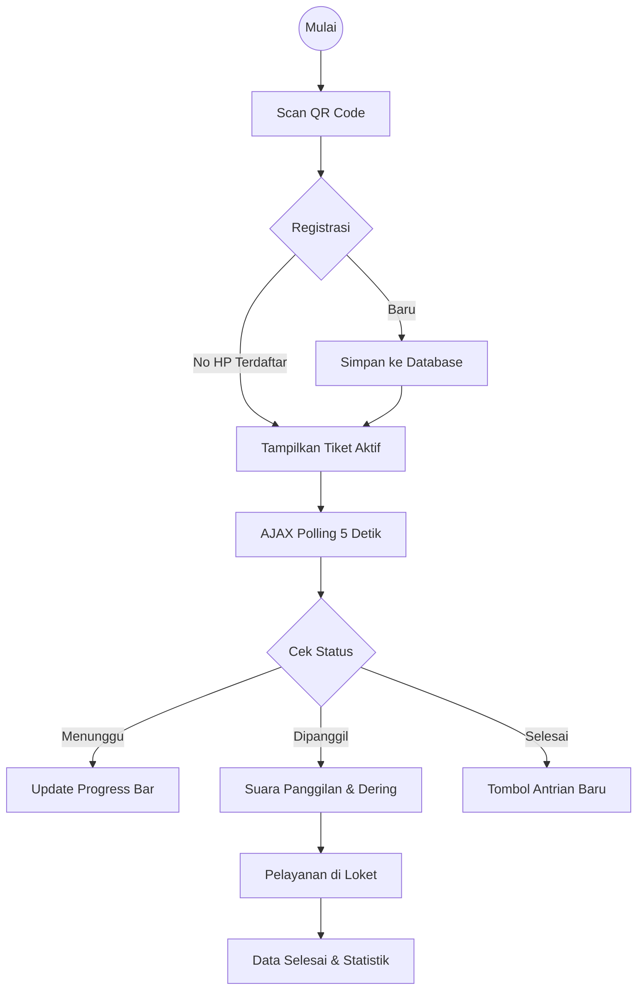

# Dokumentasi Alur Kerja - Sistem Antrian BPS

Dokumen ini menjelaskan prosedur dan mekanisme teknis dari aplikasi Sistem Antrian Cerdas BPS.

## 1. Alur Pengunjung (Mobile/QR Code)
Proses dimulai dari sisi pengunjung saat berada di area pelayanan.

| Tahap | Aktivitas | Detail Teknis |
|---|---|---|
| **Pendaftaran** | Scan QR & Isi Form | Pengunjung mengisi Nama, No HP, Alamat, dan Keperluan. |
| **Validasi** | Cek Duplikasi | Sistem mengecek apakah No HP tersebut sudah memiliki antrian aktif (Status: Menunggu/Dipanggil). |
| **Penomoran** | Generate Kode | Sistem memberikan kode unik: **K-xxx** (Konsultasi) atau **P-xxx** (Pengaduan). |
| **Monitoring** | Tiket Digital | Tiket menampilkan progres real-time dan sisa antrian di depan user. |
| **Notifikasi** | Call Notification | Menggunakan **Web Audio API**. HP akan mengucapkan nomor antrian dan membunyikan dering saat dipanggil. |

## 2. Alur Petugas (Admin Dashboard)
Proses pengelolaan antrian oleh resepsionis atau petugas loket.

1. **Pemanggilan (Calling):** Petugas menekan tombol panggil. Sistem mengubah status antrian menjadi `dipanggil`.
2. **Penyelesaian (Finishing):** Setelah dilayani, antrian ditandai `selesai` untuk mencatat waktu durasi layanan.
3. **Pending (Skipping):** Jika pengunjung tidak muncul, petugas bisa menandai sebagai `dilewati`.
4. **Registrasi Manual:** Fitur bagi petugas untuk mendaftarkan pengunjung yang tidak membawa smartphone.

## 3. Diagram Logika (Mermaid)

## 4. Keunggulan Sistem
- **Anti Double-Queue:** Mencegah spam nomor antrian dari perangkat yang sama.
- **Progress Tracking:** Memberikan kepastian waktu tunggu bagi pengunjung.
- **Accessibility:** Fitur suara (Text-to-Speech) membantu pengunjung tetap waspada tanpa harus terus menatap layar HP.
- **Reporting:** Data tersimpan rapi untuk evaluasi performa layanan bulanan.

---
*Dibuat otomatis oleh Antigravity AI Coding Assistant*
